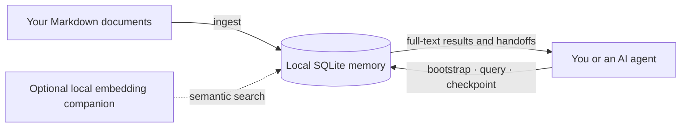
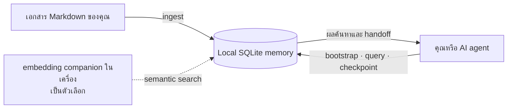

# Install ENDMEMEX

This guide installs the public, standalone release of ENDMEMEX. It assumes you
run the commands from the directory containing this file.

For the project overview and the agent/memory model, read [README.md](README.md).
For the operating workflow an AI agent should follow after installation, read
[AGENT.md](AGENT.md).

## English

### 1. Requirements

- Python 3.11 or newer
- SQLite with FTS5 support (included with most Python distributions)
- Git is optional, but useful when you want to track the project alongside
  your source code

The core database and full-text search use only the Python standard library.
Semantic search is optional and needs a local embedding companion.



### 2. Create local storage and verify it

```bash
cd /path/to/ENDMEMEX
python3 endeavor_db.py init
python3 endeavor_db.py doctor
```

`init` creates the local SQLite database at
`endeavor_memory.sqlite3`. Keep this file private: it can contain your project
notes, handoffs, and investigation history.

### 3. Add your first document

Use `ingest` to index documents you choose. The public release deliberately
ships with no private seed sources.

```bash
python3 endeavor_db.py ingest README.md --project demo --kind documentation
python3 endeavor_db.py query "local memory" --project demo --json
```

Use a stable `--project` name for all related documents, checkpoints, and
records. You can ingest your own Markdown files in the same way.

### 4. Use it during agent work

At the start of a substantial task, retrieve prior context. Save a checkpoint
after a meaningful phase so the next person or agent can resume safely.

```bash
python3 endeavor_db.py bootstrap --project demo --json
python3 endeavor_db.py query "what was decided?" --project demo --compact --json
python3 endeavor_db.py checkpoint \
  --project demo --goal "Document the decision" --agent codex \
  --summary "Indexed the project guide and checked the existing context." \
  --status active --next-steps "Add the implementation notes."
```

See [AGENT.md](AGENT.md) for the recommended query, checkpoint, and
audit/fix/verification lifecycle. Delegating a task to Codex or Claude is an
optional, separate workflow; the parent agent remains responsible for the
final conclusion and verification.

### 5. Optional: enable semantic search

Create an isolated environment and install the optional local companion:

```bash
python3 -m venv .venv
source .venv/bin/activate
python -m pip install --upgrade pip
python -m pip install fastapi uvicorn sentence-transformers pydantic
python -c "from sentence_transformers import SentenceTransformer; SentenceTransformer('paraphrase-multilingual-MiniLM-L12-v2')"
```

Then diagnose the companion before changing its configuration or restarting
anything:

```bash
python3 endeavor_db.py embed-diagnose
```

If the diagnosis is healthy, backfill embeddings and request semantic search:

```bash
python3 endeavor_db.py embed-backfill
python3 endeavor_db.py query "a concept expressed with different words" \
  --project demo --semantic on --json
```

The embedding model runs locally. The initial model download requires network
access; normal core search does not.

### 6. Keep private data out of Git

Do not commit `endeavor_memory.sqlite3`, logs, caches, local process state, or
agent-run artifacts. Review `git status` before committing. The repository's
`.gitignore` covers the normal local runtime files, but it cannot protect files
you deliberately add with `git add -f`.

### 7. Verify the release

Install `pytest` if it is not already available, then run:

```bash
python3 -m pytest developer -q
python3 endeavor_db.py doctor
```

## ภาษาไทย

### 1. สิ่งที่ต้องมี

- Python 3.11 หรือใหม่กว่า
- SQLite ที่รองรับ FTS5 (มักมากับ Python distribution ส่วนใหญ่)
- Git ไม่จำเป็นต่อการรันระบบ แต่มีประโยชน์เมื่อใช้ร่วมกับ source code ของคุณ

ฐานข้อมูลหลักและการค้นหาแบบ full-text ใช้เพียง Python standard library เท่านั้น
ส่วน semantic search เป็นตัวเลือกเสริมและต้องใช้ embedding companion บนเครื่อง



### 2. สร้างที่เก็บข้อมูลในเครื่องและตรวจสุขภาพ

```bash
cd /path/to/ENDMEMEX
python3 endeavor_db.py init
python3 endeavor_db.py doctor
```

คำสั่ง `init` จะสร้างฐานข้อมูล SQLite ในเครื่องชื่อ
`endeavor_memory.sqlite3` ไฟล์นี้อาจมีโน้ตโปรเจกต์ handoff และประวัติการสืบหา
ปัญหาของคุณ จึงควรเก็บเป็นข้อมูลส่วนตัว

### 3. เพิ่มเอกสารแรกของคุณ

ใช้ `ingest` เพื่อสร้างดัชนีให้เอกสารที่คุณเลือกเอง public release นี้ไม่มี private
seed source ติดมาด้วยโดยตั้งใจ

```bash
python3 endeavor_db.py ingest README.md --project demo --kind documentation
python3 endeavor_db.py query "local memory" --project demo --json
```

เลือกชื่อ `--project` ที่คงที่สำหรับเอกสาร checkpoints และ records ที่เกี่ยวข้องกัน
จากนั้นสามารถ ingest ไฟล์ Markdown ของคุณด้วยรูปแบบเดียวกัน

### 4. ใช้ระหว่างทำงานร่วมกับ agent

เมื่อเริ่มงานที่มีขนาดพอสมควร ให้ดึงบริบทเดิมก่อน และบันทึก checkpoint หลังจบช่วงงาน
สำคัญ เพื่อให้คนหรือ agent ถัดไปทำงานต่อได้อย่างปลอดภัย

```bash
python3 endeavor_db.py bootstrap --project demo --json
python3 endeavor_db.py query "what was decided?" --project demo --compact --json
python3 endeavor_db.py checkpoint \
  --project demo --goal "Document the decision" --agent codex \
  --summary "Indexed the project guide and checked the existing context." \
  --status active --next-steps "Add the implementation notes."
```

ดู workflow ที่แนะนำสำหรับ query, checkpoint และ lifecycle แบบ
audit/fix/verification ได้ที่ [AGENT.md](AGENT.md) การส่งงานไปให้ Codex หรือ
Claude เป็น workflow เสริมที่แยกออกมา โดย parent agent ยังคงรับผิดชอบข้อสรุปและการ
ตรวจสอบสุดท้าย

### 5. ตัวเลือกเสริม: เปิดใช้ semantic search

สร้าง environment แยก แล้วติดตั้ง companion ที่รันในเครื่อง:

```bash
python3 -m venv .venv
source .venv/bin/activate
python -m pip install --upgrade pip
python -m pip install fastapi uvicorn sentence-transformers pydantic
python -c "from sentence_transformers import SentenceTransformer; SentenceTransformer('paraphrase-multilingual-MiniLM-L12-v2')"
```

ก่อนปรับ configuration หรือ restart สิ่งใด ให้ตรวจ companion ด้วยคำสั่งนี้ก่อนเสมอ:

```bash
python3 endeavor_db.py embed-diagnose
```

เมื่อผลการวินิจฉัยพร้อมใช้งานแล้ว จึงสร้าง embeddings ย้อนหลังและค้นหาแบบ semantic:

```bash
python3 endeavor_db.py embed-backfill
python3 endeavor_db.py query "a concept expressed with different words" \
  --project demo --semantic on --json
```

โมเดล embedding ทำงานในเครื่อง การดาวน์โหลดโมเดลครั้งแรกต้องใช้อินเทอร์เน็ต แต่การ
ค้นหาหลักของระบบไม่ต้องใช้อินเทอร์เน็ต

### 6. อย่านำข้อมูลส่วนตัวเข้า Git

ห้าม commit `endeavor_memory.sqlite3`, logs, caches, local process state หรือ
agent-run artifacts ตรวจ `git status` ก่อน commit ทุกครั้ง `.gitignore` ของ
repository ครอบคลุม runtime files ตามปกติ แต่ไม่สามารถป้องกันไฟล์ที่คุณสั่ง
`git add -f` เองได้

### 7. ตรวจสอบว่า release ใช้งานได้

ติดตั้ง `pytest` หากยังไม่มี แล้วรัน:

```bash
python3 -m pytest developer -q
python3 endeavor_db.py doctor
```
